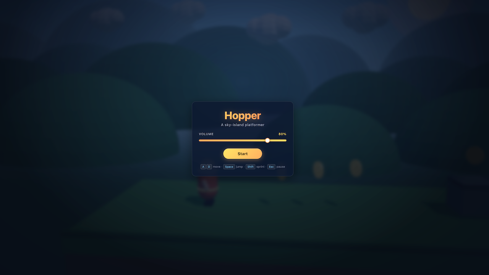
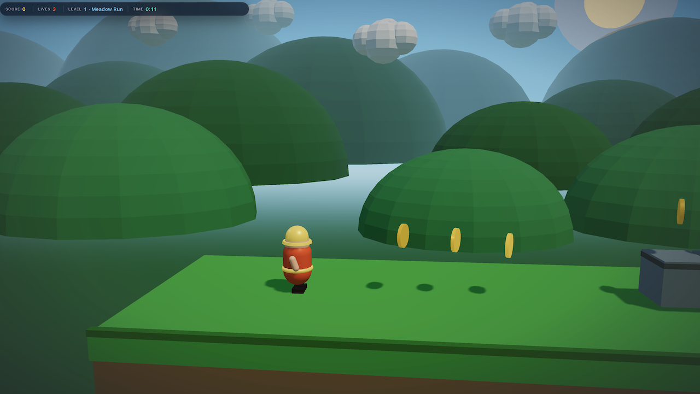
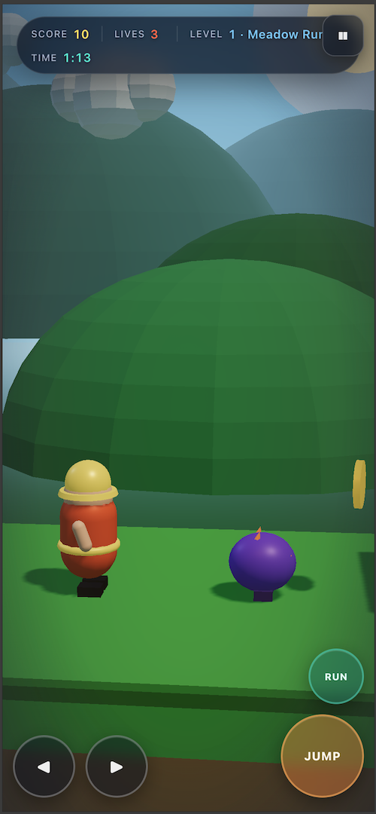
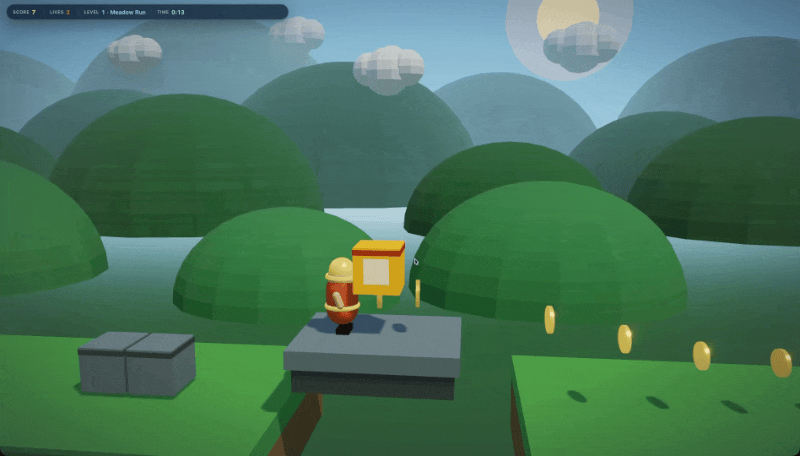

# Hopper

**A stylish 2.5D browser platformer with tight jumps, juicy feedback, and full audio — playable on desktop and phone.**

Guide **Hopper** across sky-island stages: run, leap, collect coins, stomp **Bruisers** and **Skimmers**, and race the flag. Built in **TypeScript** with **three.js** and **Howler** — original characters and audio, no Nintendo IP.

[](https://YOUR-LIVE-DEMO-URL.example)
[](https://www.typescriptlang.org/)
[](https://threejs.org/)
[](https://vitejs.dev/)
[](#license)

---

## Live demo

> **Play in the browser:** [https://YOUR-LIVE-DEMO-URL.example](https://YOUR-LIVE-DEMO-URL.example)  

---

## Screenshots

<!-- Drop real assets under docs/ or assets/ and update the paths below. -->

| Menu / title | Gameplay | Mobile |
| :----------: | :------: | :----: |
|  |  |  |

**GIF (gameplay loop):**



---

## Features

- **Snappy platformer feel** — coyote time, jump buffer, variable jump height, asymmetric gravity
- **Two complete levels** — *Meadow Run* (tutorial pacing) and *Ridge Climb* (tighter vertical challenge)
- **Enemies** — ground **Bruisers** (patrol + stomp) and flying **Skimmers**
- **Collectibles & score** — spinning coins, lives, level clear → victory summary
- **2.5D visuals** — three.js lighting, real-time shadows, parallax skies, soft bloom & vignette
- **Juice** — particles, screen shake, squash-and-stretch, landing dust
- **Full audio** — looping BGM + SFX (jump, land, coin, stomp, death, flag) via Howler
- **Desktop + mobile** — keyboard or multi-touch on-screen pads (move + jump together)
- **Zero-friction toolchain** — `npm install && npm run dev`

---

## Quick start

**Requirements:** Node.js (modern LTS) and a browser with WebGL.

```bash
npm install
npm run dev
```

Open the URL Vite prints (default **http://localhost:5173/**).

### Play on your phone (same Wi‑Fi)

```bash
npm run dev -- --host
```

Then open `http://<your-lan-ip>:5173/` on the phone. After **Start**, virtual **◀ ▶ / JUMP / RUN** controls appear.

### Production build

```bash
npm run build
npm run preview
```

| Script | Description |
|--------|-------------|
| `npm run dev` | Vite dev server + HMR |
| `npm run build` | Typecheck (`tsc`) + production bundle → `dist/` |
| `npm run preview` | Serve the production build |
| `npm run generate-audio` | Regenerate placeholder WAV SFX/BGM |

---

## Controls

| Action | Desktop | Touch |
|--------|---------|--------|
| **Move** | `A` / `D` or `←` / `→` | **◀** **▶** |
| **Jump** | `Space` (hold for full height) | **JUMP** |
| **Sprint** | `Shift` | **RUN** |
| **Pause** | `Esc` | **❚❚** |
| **Volume** | Menu slider or `[` / `]` | Menu slider |

---

## Levels

| # | Name | What to expect |
|---|------|----------------|
| 1 | **Meadow Run** | Learn the ropes — friendly gaps, coins, first stomps (~1–2 min) |
| 2 | **Ridge Climb** | Pipes, vertical routes, denser threats — clear the flag to win |

**Win:** touch each level’s flag pole. Beat both stages for the victory screen (score, lives, time).

---

## Tech stack

| Layer | Choice |
|-------|--------|
| Language | **TypeScript** |
| Rendering | **three.js** (WebGL, shadows, materials) |
| Post-FX | EffectComposer — Unreal bloom, color grade, vignette |
| Audio | **Howler.js** |
| Tooling | **Vite** + `tsc` |
| Physics | Custom AABB + sub-stepping (no external physics engine) |
| UI | Custom DOM (HUD, menus, touch controls) |

Not Unity, Godot, or Phaser — a lean custom game loop on WebGL.

For a deeper technical write-up (architecture, juice systems, fact sheet), see **[TECH.md](./TECH.md)**.

---

## Project layout

```
src/
  audio/          Howler manager + sound registry
  collectibles/   Coins
  enemies/        Bruiser, Skimmer
  fx/             Particles, shake, juice, post-FX
  game/           Loop, input, camera, config, states
  levels/         Level defs, loader, collision, parallax
  player/         Controller + mesh (squash / stretch)
  ui/             HUD, menus, touch controls, styles
public/assets/audio/   Music + SFX
```

---

## License

**Open source.**  
No separate license file is committed yet — treat the project as open source for personal and educational use until a formal SPDX license (e.g. MIT) is added.

Original art direction and audio placeholders — **do not use Nintendo names, assets, or trademarks**.

---

<p align="center">
  <strong>Hopper</strong> — jump once, buffer twice, stomp forever.<br/>
  <sub>Built with TypeScript · three.js · Howler · Vite</sub>
</p>
